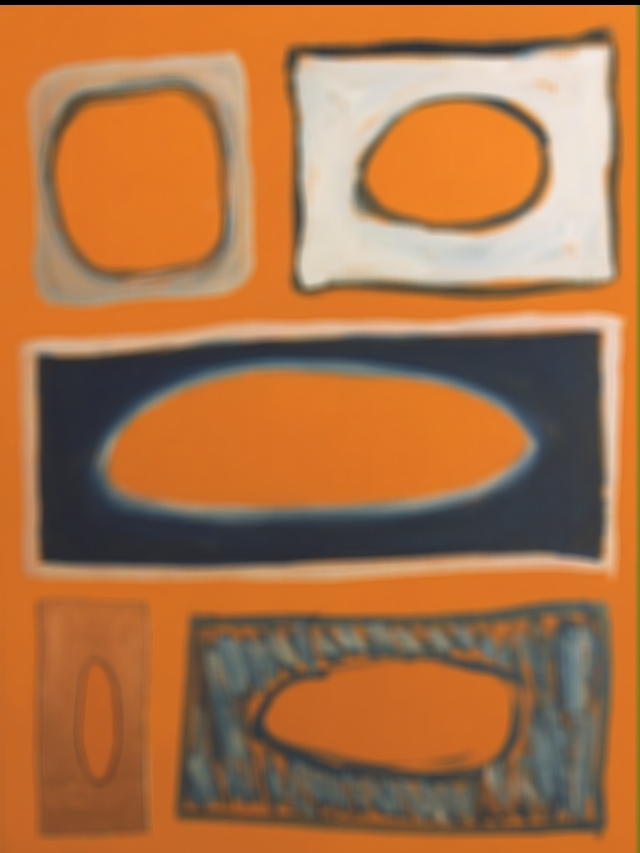
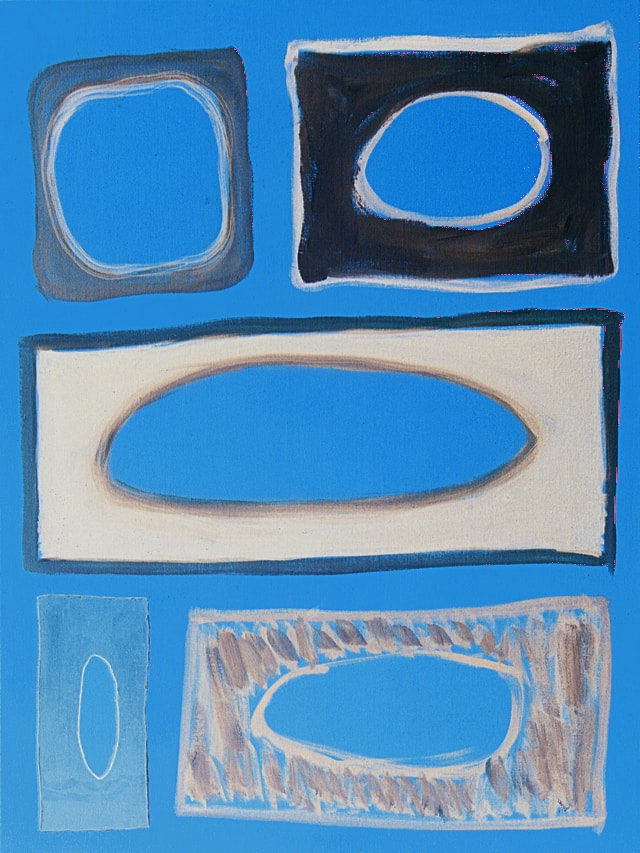

# Imagery

### Image processing CLI written in Golang for .jpg files

## Examples:

``` ./main --blur ./examples/fons-heijnsbroek.jpg ```

#### Original:


#### Transformed Result:



``` ./main --negative ./examples/fons-heijnsbroek.jpg ```

#### Original:


#### Transformed Result:

